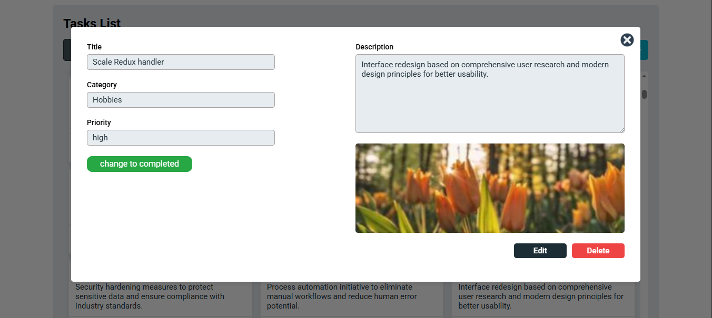
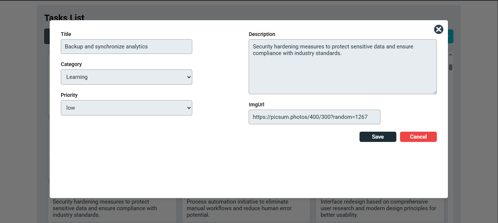
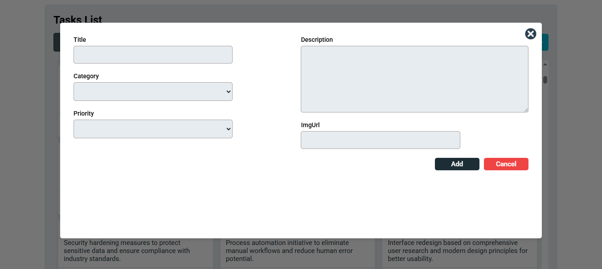

# Project Name

## Description
simple task manager created with vite + vue.js and Supabase

## Features
- Display tasks data as a list with main info in each task card.
- Filter tasks by category
- Details page for each task with full info, status toggle and (edit,delete) options
- Edit task data
- Delete task
- Add new task 
- Add and Edit form validations with required fields(title, category)
- loading and error states during data fetching

## Tech Stack
- Vue 3
- Pinia
- CSS
- Vite
- Supabase
- Other technologies you used

## State management
```
- task store: which contain 
tasks=> stores tasks retreved from the database, 
categories=> stores categories retreved from the database,
loading=> loading state during retreving data

- taskDetails store : which contain
taskData=> stores main info of the task
display=> boolean value that control taskDetails page visability
loading=> loading state during status change (completed/pending)

- editForm store : which contain
editFormData=> input data from edit form which is (task data by default)
display=> boolean value that control edit form visability
loading=> loading state during saving data

- addForm store : which contain
editFormData=> input data from addition form.
display=> boolean value that control add form visability
loading=> loading state during saving data
```
## Components Structure
```
    <APP>
        <TaskList>
            <Task/>
        </TaskList>
        <DetailsForm/>
        <AddForm/>
        <EditForm/>
    </APP>
```
## Setup & Installation

1. **Clone the project**
```bash
git clone <your-repo-url>
```
2. **install npm**
```bash
npm install
```
3. **Create .env file**
```bash
VITE_SUPABASE_PROJECT_ID=xxx
VITE_SUPABASE_ANON_KEY=xxx
```
4. **Run the project**
```bash
npm run dev
```

## App Screenshots



